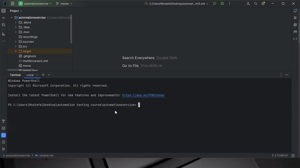

# AwesomeQa

## Table of Contents

- [Introduction](#introduction)
- [Features](#features)
- [Installation](#installation)
- [Usage](#usage)
- [Contributing](#contributing)
- [License](#license)

## Introduction

Automation Exercise is a website that provides testcases to test an automation scenarios for testing an E-commerce project. Using Java and selenium webdriver, with TestNG. The project utilizes the Page Object Model (POM) design pattern and will integrate with some updates soon.

## Features

- *Account*: Create and manage user accounts.
- *Cart*: Add some products to cart.
- *Products*: Add some products to Cart and filter it.
- *Products Details*: Check Product details and can edit and add review.
- *Order*: Create end to end order from registering, adding item to cart, checkout and pay and dwonload invoice.

## Installation

To set up the Automation Exercise application locally, follow these steps:

1. Clone the repository:
*   git clone https://github.com/Darshfb/automation-exercise
2. Navigate to the project directory:
*   cd automation-exercise
3. Install dependencies:
*   npm install
4. Configure the application:

* Update configuration files with necessary settings.
5. Run the application:
*   npm start

## Usage
* User Guide: Refer to the User Guide for detailed information on how to use the AwesomeQa website.

### Local testing execution example

## Contributing
* We welcome contributions from the community. To contribute to Automation Exercise, follow these steps:

## Fork the repository.
* Create a new branch for your feature or bug fix.
* Make your changes and submit a pull request.

## License
* Automation Exercise project is licensed under the MIT License.